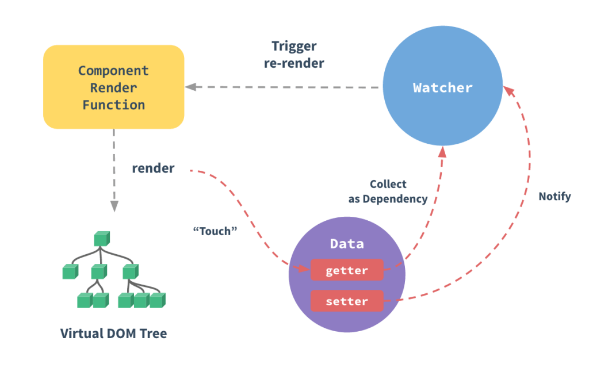

### 什么叫数据响应式
数据发生改变的时候，视图会重新渲染，匹配更新为最新的值
#### 数据响应式的原理


数据响应式是发布者订阅者模式，是一对一或一对多的模式，当发布者更新时订阅者同步更新。

#### Object.defineProperty

Vue的数据响应式利用了Object.defineProperty的get和set方法，当数据被访问时会触发get，数据改变时会触发set
```javascript
let obj = {
    name:"tony"
}
Object.defineProperty(obj,"name",{
    get(){
        console.log("get 被触发")
    }
    set(val){
        console.log("set 被触发")
    }
})

obj.name //被访问时 get会被触发
obj.name = "mike" //obj.name被更改时 set会被触发
```
#### 依赖收集

data中的声明的每个属性，都拥有一个数组，保存着页面，computed,watch等的watcher这叫做依赖收集。
data中的每个声明的属性，都会有一个专属的依赖收集器subs，Object.defineProperty -get方法被触发的时候，页面的watcher就会被放到依赖收集器subs中
#### 依赖更新
依赖更新就是当数据变化时，通过依赖收集器subs将保存其中的依赖项进行更新。Object.defineProperty -set改变数据时，会通知各个watcher进行视图重新更新。